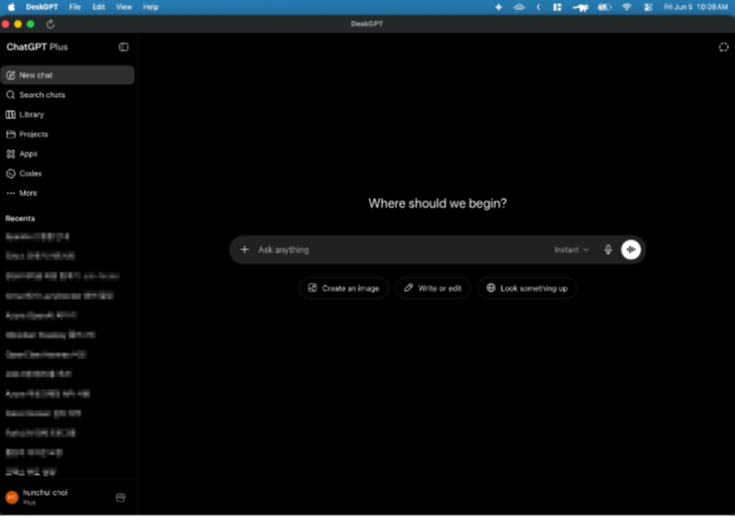

# 📄 DeskGPT: Standalone macOS ChatGPT Application

<p align="center">
  
</p>

## Screenshot

<p align="center">
  
</p>

**DeskGPT** is a very small macOS program that simply opens `chatgpt.com` inside a native WebKit webview.

It does not collect your data. The only network calls it makes outside ChatGPT itself are to **GitHub Releases** so it can check whether a new version is available.

I made it because opening Safari and going to `chatgpt.com` over and over again was annoying.

This app intentionally does almost nothing beyond wrapping ChatGPT in a native window, keeping your session alive, and making a few browser-like actions feel better on macOS.

---

## Minimal by Design

* This is basically a native `chatgpt.com` webview wrapper for macOS.
* It does not collect your data.
* The only extra network traffic is GitHub Release checking for updates.
* There are very few extra features on purpose. Most of the code exists to make the plain ChatGPT site feel a little more comfortable on a Mac.

---

## ✨ Key Features

* **Permanent Session Persistence**: Integrates the default persistent website data store (`WKWebsiteDataStore.default()`) so that cookies, local storage, and your ChatGPT login sessions remain securely saved across restarts.
* **Bot Gate Bypass**: Injects standard modern macOS Safari User Agents to prevent ChatGPT / Cloudflare security gates from blocking the embedded webview.
* **Raycast `/gpt` Launcher**: Accepts prompts from Raycast script commands, brings DeskGPT to the foreground, and auto-submits the question into ChatGPT.
* **Always on Top (Floating Window) ⭐️**: Toggles floating window levels via shortcut (`Cmd + Shift + T`) or the View menu, allowing you to keep ChatGPT visible in a corner of your screen while writing code or documents.
* **PDF Chunker & Smart Injector 📁**: Solves the context-limit and long-document prompt issues. Opens a native floating assistant window (`Cmd + Shift + P`) powered by macOS native **`PDFKit`**. It extracts text from any PDF with blazing-fast speed, splits it into logic chunks (default: 4,000 characters), and automatically injects them into the ChatGPT prompt field with custom instructions—fully triggering React input detection.
* **Native File Uploads & Downloads**: Seamlessly integrates macOS native save panels (`NSSavePanel`) and open panels (`NSOpenPanel`) for file uploads (document analysis) and generated file downloads (code files, CSVs, images).
* **Image Context Menu Fixes**: Adds native-style image actions in ChatGPT such as save to Downloads, Save As, copy image address, and copy image.
* **Native Navigation & Zooming**: Built-in standard browser keyboard mappings: Reload (`Cmd+R`), Go Back (`Cmd+[`), Go Forward (`Cmd+]`), and page zooming (`Cmd+=` / `Cmd+-` / `Cmd+0`).
* **Cache & Session Purging**: Provides an emergency "Reset Session & Restart" option under the Help menu to wipe cookies, caches, and service workers cleanly in case of connectivity or auth errors.

---

## 📂 File Structure

```text
├── src/
│   ├── main.swift             # App bootstrap, activation policy configuration, and event run loop
│   ├── AppDelegate.swift      # Application lifecycle, system menu bindings, and direct NSWindow management
│   ├── DeskGPTViewController.swift # Core WKWebView setup, session preservation, native file panels, and JS injector
│   ├── DeskGPTPDFViewController.swift # PDFKit high-speed text extraction, chunking, and clipboard/chat injectors
│   └── Info.plist             # App metadata bundle configuration (AppIcon mapping, system version targets)
├── build.sh                   # One-touch compilation, packaging, /Applications install, and LaunchServices registration
├── README.md                  # Project documentation (English)
└── .gitignore                 # Exclusion configuration for build artifacts and OS caches
```

---

## 🛠️ Build & Installation (One-Touch Package)

If you have Xcode Command Line Tools installed (which includes the standard `swiftc` compiler), you can compile and package the application natively in seconds:

1. **Navigate to the Repository**:
   ```bash
   cd gpt_exe
   ```

2. **Run the Build Script**:
   ```bash
   chmod +x build.sh
   ./build.sh
   ```
   *This script automatically resizes the high-resolution flat PNG icon into standard macOS icon sizes using `sips`, packages it into `AppIcon.icns` using `iconutil`, compiles all Swift source files, installs the app into `/Applications/DeskGPT.app`, and registers it with LaunchServices.*

3. **Launch the App**:
   ```bash
   open /Applications/DeskGPT.app
   ```

> [!TIP]
> Drag and drop the compiled `DeskGPT.app` into your macOS `/Applications` (Applications) folder. Once moved, it integrates fully with your macOS system, making it searchable via Spotlight Search (`Cmd + Space -> DeskGPT`) and launchable directly from Launchpad!

---

## ⚡ Raycast Integration

DeskGPT can be driven directly from Raycast with a local script directory. The current setup expects the scripts to live outside the repo at:

```text
~/projects/raycast_script
```

Use the following commands:
* `send-to-deskgpt.js` for typed prompts
* `send-selection-to-deskgpt.js` for selected text piped from Raycast

Recommended Raycast setup:
1. Add `~/projects/raycast_script` as a Script Directory in Raycast.
2. Register `send-to-deskgpt.js` as a `Silent` script command with an argument.
3. Optionally map it to `/gpt`.
4. Run it to bring DeskGPT to the foreground and auto-send the prompt.

---

## 🧭 Current UX Notes

* DeskGPT now tries to stay in the foreground when launched from Raycast or reopened from a hidden state.
* The ChatGPT image context menu has been customized so image saving and copying behave more like a native macOS app.

---

## 🔮 Future Roadmap (On-Device RAG Vision)

DeskGPT's native lightweight architecture is highly extensible for advanced offline feature additions:
* **Fully Private On-Device Embeddings**: Bundling an offline, CoreML-optimized multilingual embedding model (like `Multilingual-MiniLM`) using Apple Silicon's Neural Engine (ANE) for 100% free offline semantic indexing.
* **Category-based Multi-VectorDB**: Integrating a lightweight local SQLite database framework (`sqlite-vss`) in `Library/Application Support` to allow secure, air-gapped category-based document partitioning.
